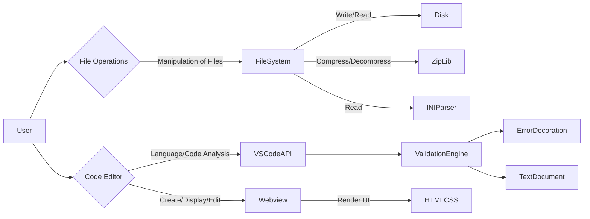
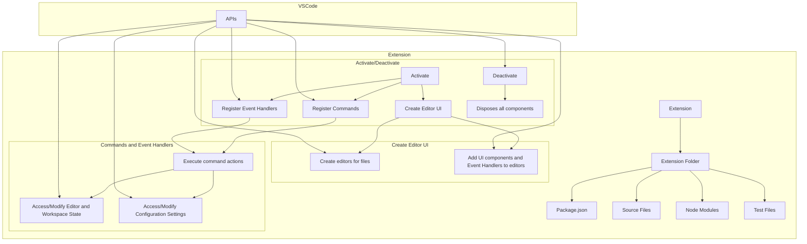
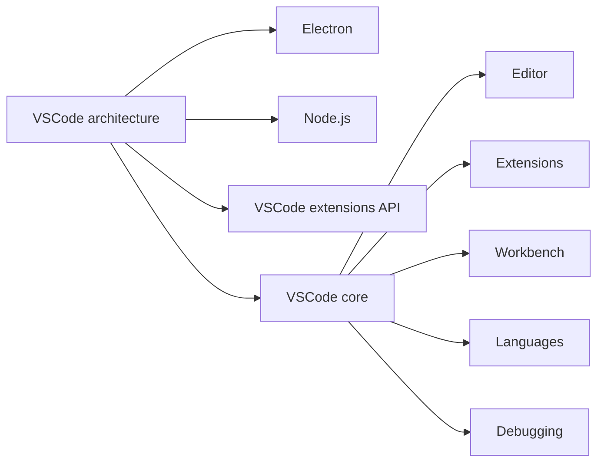
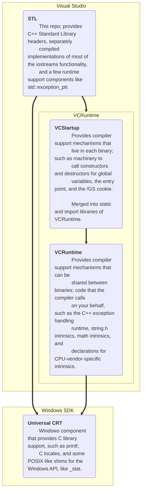

How to find more prompts:
enter ```mermaid in github search
https://github.com/search?q=%60%60%60mermaid&type=code

## Example prompts

Diagram for architecture of a vscode extension

## Good response



## More detailed, so so



Diagram for architecture of a vscode open source project. How is it achitecturally structured?

## Good



## Actual production diagrams found online


